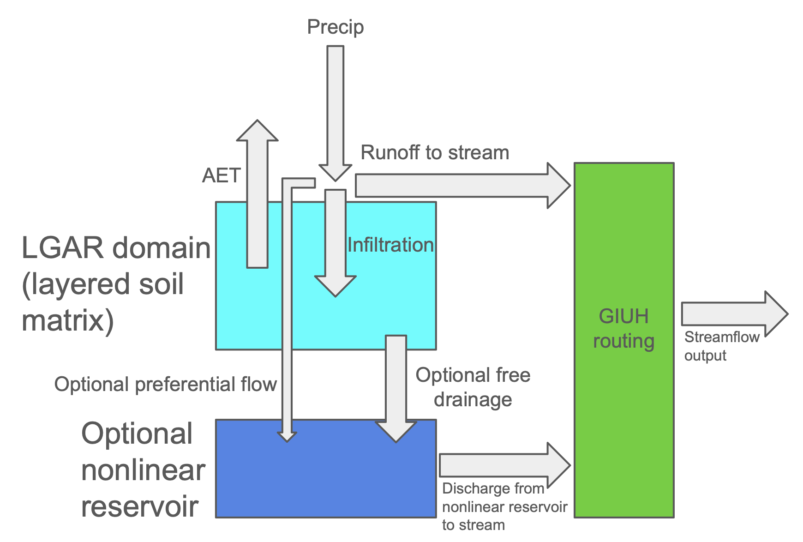

# Catchment Arid/Semi-arid Model (CASAM) for streamflow simulation
CASAM (formerly known as LASAM) is a catchment scale hydrolgic model originally designed for arid or semi arid areas, in which the partitioning of precipitation into infiltration and runoff is important. CASAM is composed of a vadose zone model, which is Layered Green & Ampt with redistribution (LGAR) and represents a layered soil matrix, and a nonlinear reservoir which is filled via a simple formulation for preferential flow. LGAR is a model which partitions precipitation into infiltration and runoff, and is designed for use in arid or semi-arid climates. LGAR closely mimics precipitation partitioning results simulated by the Richards/Richardson equation (RRE), without the inherent reliability and stability challenges the RRE poses. Therefore, this model is useful when accurate, stable precipitation partitioning simulations are desired in arid or semi-arid areas. LGAR in Python (no longer supported) is available [here](https://github.com/NOAA-OWP/LGAR-Py).

LGAR is designed for use in environments where cumulative potential evapotranspiration is greater than cumulative precipitation. Because the lower boundary condition of LGAR is currently effectively no-flow, the model assumes that water only leaves the vadose zone via AET, which one might expect in arid and semi arid areas.

CASAM is theoretically a skillful catchment scale hydrolgic model in the event that precipitation partitioning into infiltration and runoff is the most important process for streamflow generation in a given catchment. Nonetheless, CASAM also includes a nonlinear reservoir so that some water stored in the catchment can contribute directly to streamflow (currently, we assume soil water does not directly contribute to streamflow).

**Published papers:** For details about the model please see our manuscript on LGAR ([weblink](https://agupubs.onlinelibrary.wiley.com/doi/full/10.1029/2022WR033742)).

## Build and Run Instructions
Detailed instructions on how to build and run CASAM can be found here [INSTALL](https://github.com/NOAA-OWP/LGAR-C/blob/master/INSTALL.md).
- Test examples highlights
  - simulations with synthetic forcing data and unittest (see [build/run](https://github.com/NOAA-OWP/LGAR-C/blob/master/tests/README.md)). 
  - simulations with real forcing data (see [build/run](https://github.com/NOAA-OWP/LGAR-C/blob/master/INSTALL.md#standalone-mode-example))
  - CASAM coupling to Soil Freeze Thaw (SFT) model (see [instructions](https://github.com/NOAA-OWP/LGAR-C/blob/master/INSTALL.md#lasam-coupling-to-soil-freeze-thaw-sft-model))

## Model Configuration File
A detailed description of the parameters for model configuration is provided [here](https://github.com/NOAA-OWP/LGAR-C/tree/master/configs/README.md).

## Calibratable parameters
A detailed description of calibratable parameters is provided [here](https://github.com/NOAA-OWP/LGAR-C/tree/master/data/README.md).

## Nextgen Realization Files
Realization files for running CASAM (coupled/uncoupled modes) in the nextgen framework are provided [here](https://github.com/NOAA-OWP/LGAR-C/tree/master/realizations/README.md).
  
## Getting help
For questions, please contact Ahmad (ahmad.jan(at)noaa.gov) and/or Peter (peter.lafollette(at)noaa.gov), the two main developers/maintainers of the repository.

## Known issues or raise an issue
CASAM is a newly developed model and we are constantly looking to improve the model and/or fix bugs as they arise. Please see the Git Issues for known issues or if you want to suggest adding a capability or to report a bug, please open an issue.

## Getting involved
See general instructions to contribute to the model development ([instructions](https://github.com/NOAA-OWP/LGAR-C/blob/master/CONTRIBUTING.md)) or simply fork the repository and submit a pull request.
